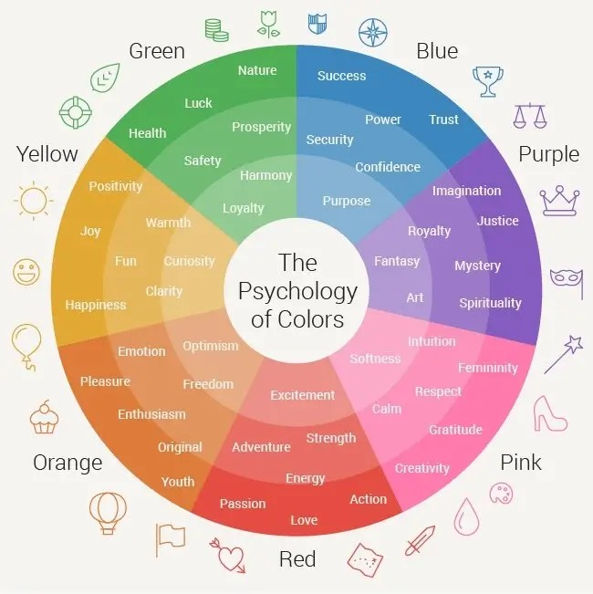
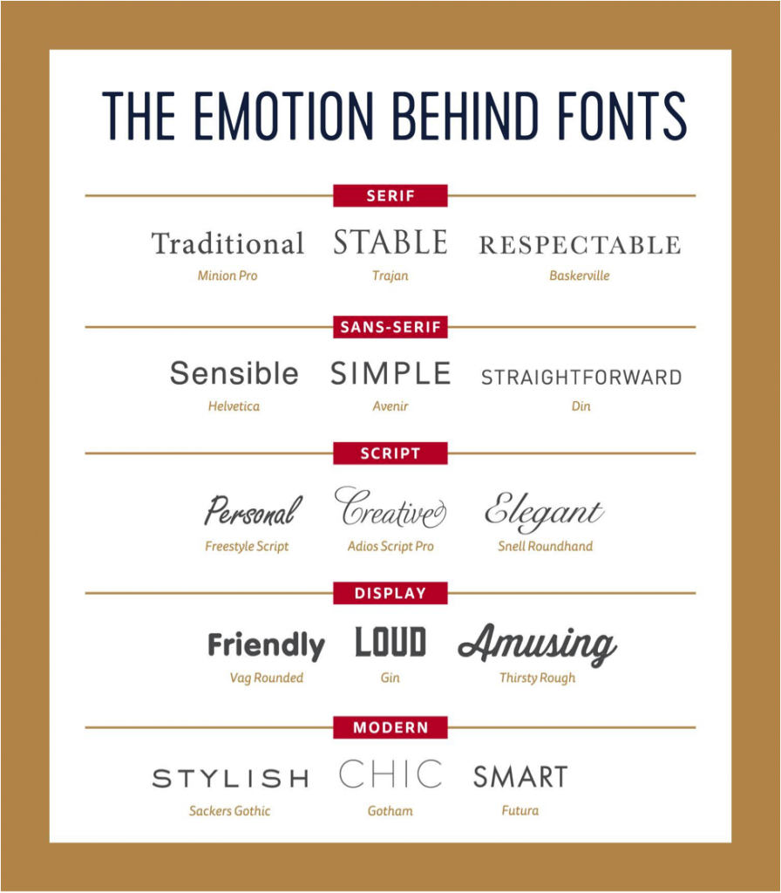

# Web design basics

https://www.dailyui.co/

https://www.canva.com/

https://collectui.com/

---

## Colour theory

https://colorhunt.co/

https://color.adobe.com/ru/create/color-wheel

---

## Fonts

https://fonts.google.com/

---

### Sizes

---

### Layouts

---

### Alignment

---

### Whitespace

---

### Audience

---

## UX